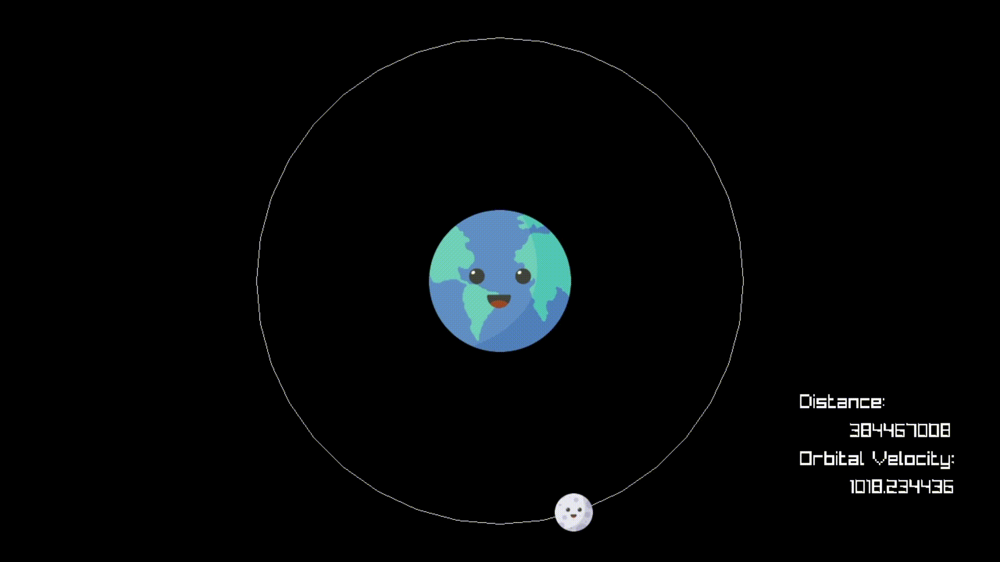

<h1 align="center">GraviSim</h1>

  

    <strong>A simple orbit and orbital speed visualizer.</strong>
  

  

    
    
  

## Description
Made with C++ using raylib to render. GraviSim is a simple visualizer to show orbital velocity increasing when orbital radius gets lower and vice-versa. To control just press A and D, R resets to an earth-moon standard (image not to scale).

## Usage

    

## Author

| [ @rafafelps](https://github.com/rafafelps)  |
| :---: |
